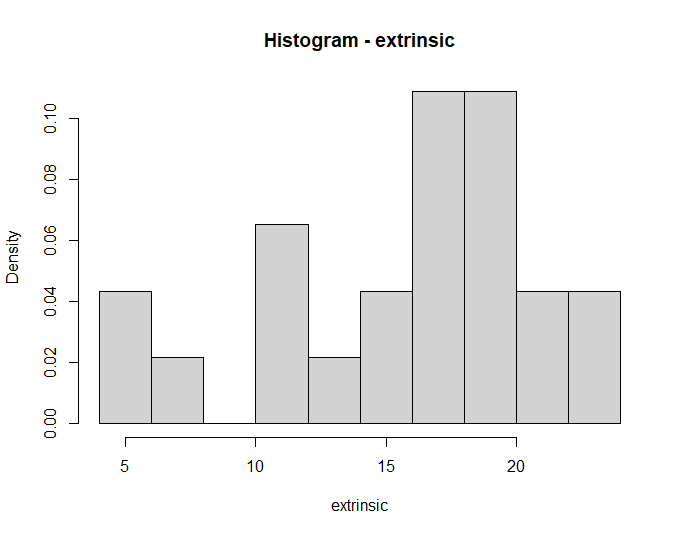
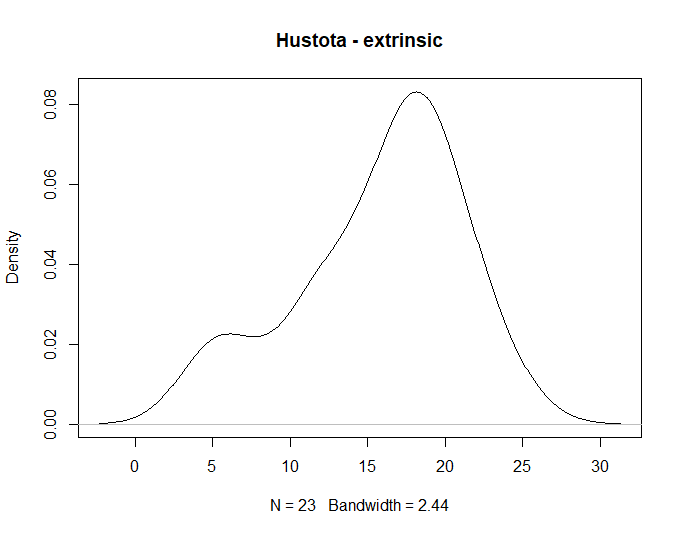
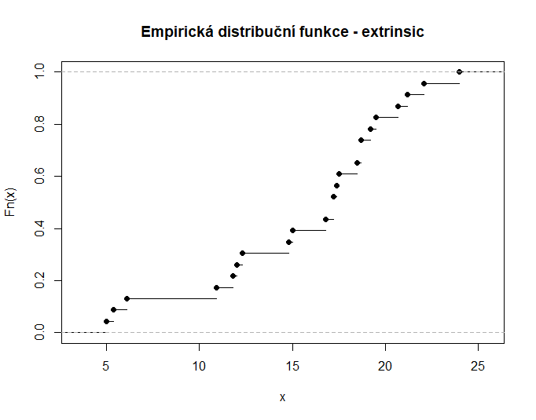
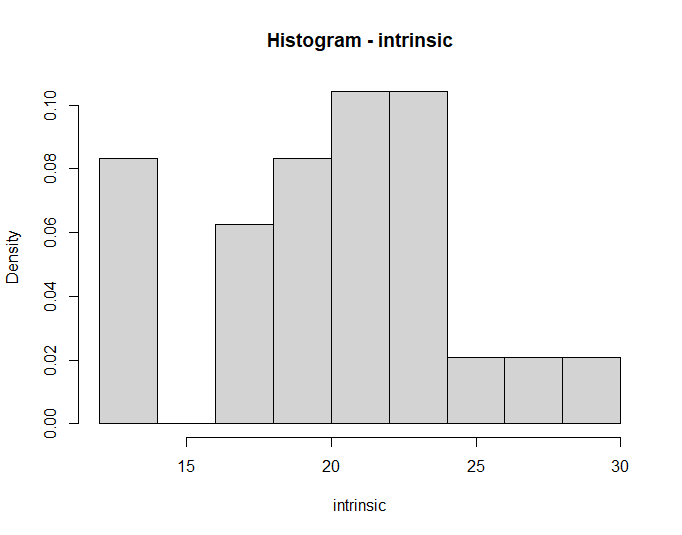
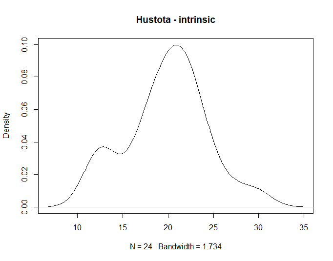
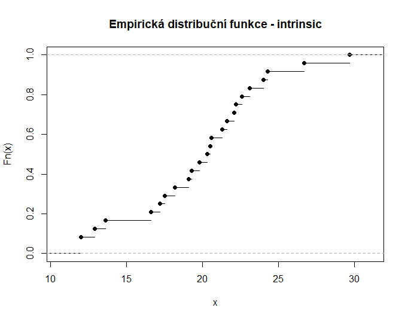
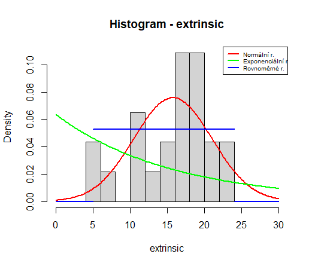

# PST - úkol

# Úvod

Úkol jsme zpracovali ve dvojici:

- Aneta Potomská (potomane) (reprezentant)
- David Gaier (gaierda1)

Vypočítáme si, který soubor budeme nakonec zpracovávat (viz [https://courses.fit.cvut.cz/BI-PST/homework/index.html](https://courses.fit.cvut.cz/BI-PST/homework/index.html))

```r
K <- 14 # 14.1.
L <- 8 # Potomská
M <- ((K+L)*47)%%(11)+1 # 1
```

M vyšlo jako 1, tedy budeme zpracovávat soubor **case0101** ze Sleuth2. Soubor si tedy načteme:

```r
library(Sleuth2)
path <- "C:/my_data.csv"
write.table(case0101, path, row.names=F, sep=";", dec=",")
```

Při psaní jsme často čerpali z přednášek a také z materiálů z mameradipst. 
K vytvoření tohoto dokumentu jsme využili nástroje: 

- RStudio pro psaní kódu v R
- Overleaf/Notion pro psaní latex vzorečků

# Úkol 1

## Zadání

(1b) Načtěte datový soubor a rozdělte sledovanou proměnnou na příslušné dvě pozorované skupiny. Stručně popište data a zkoumaný problém. Pro každou skupinu zvlášť odhadněte střední hodnotu, rozptyl a medián příslušného rozdělení.

## Teorie

Odhady se berou na 9. přednášce

### Střední hodnota

Odhad střední hodnoty se dělá pomocí aritmetického průměru (výběrový průměr).

$$
\widehat{\text EX} = \overline{X_n} = \frac{1}{n} \cdot \sum_{k=1}^n{X_k}
$$

V R na to máme funkci `mean()`.

### Rozptyl

Rozptyl odhadneme pomocí výběrového rozptylu nestranný (po [Besselově korekci](https://en.wikipedia.org/wiki/Bessel%27s_correction)).

$$
\widehat{\text{var}(X)} = s_n^2 = \frac{1}{n-1}\cdot\sum_{k=1}^n\big(X_k - \overline{X_n}\big)^2
$$

V R na to máme funkci `var()`.

### Medián

Když budu citovat z přednášky: “Medián $q_{0.5}$ tak odhadneme jako prostřední hodnotu ze seřazených dat, $x_{(⌈\frac{n}{2}⌉)}$. Jedná se tak o inverzi empirické distribuční funkce.
Je-li počet dat sudý, některý software odhaduje medián jako průměr $x_{(\frac{n}{2})}$ a $x_{(\frac{n}{2} +1)}$”

$$
\text{median}(X_n) = q_{0.5} = \begin {cases} x_{\lceil\frac{n}{2}\rceil}, &{n\mod 2 = 1} \\ \frac{x_{\frac{n}{2}} + x_{\frac{n}{2}+1}}{2} &{n\mod 2 = 0}\end {cases}
$$

V R na to máme funkci `median()`.

## Řešení

Datový soubor si tedy načteme:

```r
dataTable <- read.table(path, header=TRUE, sep=";")
```

Téma datasetu je: **“motivace a kreativita”**. 

Informace k tomuto datasetu jsme čerpali přímo ze Sleuth2 ([https://cran.r-project.org/web/packages/Sleuth2/Sleuth2.pdf](https://cran.r-project.org/web/packages/Sleuth2/Sleuth2.pdf)) a také ze zdroje v něm uvedeném (*Amabile, T. (1985). Motivation and Creativity: Effects of Motivational Orientation on Creative Writers, Journal of Personality and Social Psychology 48(2): 393–399.),* konkrétně z abstraktu této práce ([https://psycnet.apa.org/record/1985-19751-001](https://psycnet.apa.org/record/1985-19751-001)).

Tato studie zkoumá vliv vnitřní a vnější motivace na kreativitu. Účastníci, 72 členů vysokoškolské komunity, aktivně se věnujících tvůrčímu psaní, se zúčastnili laboratorních sezení, kde napsali 2 básně. 

Cílem bylo zkoumat, zda vnitřní motivace podporuje kreativitu a vnější motivace ji snižuje. Vnitřní motivace byla definována jako zájem a potěšení ze psaní samotného. Zatímco vnější motivace byla chápána tak, že důvod ke psaní vycházel z touhy po získaní něčeho vnějšího, myšleno např. odměny nebo pochvaly. 

Účastníci byli přibližně rovnoměrně rozděleni do skupin s vnitřní motivací, vnější motivací a kontrolní skupinu. Předtím než se měla psát druhá báseň, byli účastníci ze skupin s vnitřní motivací a tou vnější vyzváni aby vyplnili dotazník. Ten se je ptal na jejich motivace a důvody pro psaní. Pro ty s vnější motivací se ptal na vnější důvody a pro ty s vnitřní zase pro vnitřní. 

Výsledky naznačují, že i když neexistovaly počáteční rozdíly mezi podmínkami v předchozím zapojení do psaní nebo v kreativitě prvních básní, po experimentálních manipulacích došlo k významným rozdílům ve kreativitě napsaných básní. Básně napsané ve vnější orientaci byly výrazně méně kreativní. Studie se pak dále zabývá možnými sociálně-psychologické a individuální rozdíly v kreativitě.

Dataset obsahuje 47 záznamů (celková velikost vzorku, jsou zde tedy jen záznamy od skupin s vnější a vnitřní motivací, ne od kontrolní) a každý obsahuje informaci o:

- “Score”: skóre kreativity daného subjektu (z textu usuzujeme, že se jedná o bodové ohodnocení míry kreativity, které účastník ukázal, jak se hodnotilo však není v abstraktu rozebíráno)
- “Treatment”: jaké motivaci (faktor) byl subjekt vystaven
    - “Extrinsic” (vnější)
    - “Intrinsic” (vnitřní)

Podle “Treatment” se nám tedy subjekty rozdělují na dvě skupiny. Postupně zpracujeme obě dvě.

### Extrinsic

Takto vypadají záznamy obsahující tuto skupinu.

```
              Score Treatment
1                 5 Extrinsic
2  5,40000009536743 Extrinsic
3  6,09999990463257 Extrinsic
4  10,8999996185303 Extrinsic
5  11,8000001907349 Extrinsic
6                12 Extrinsic
7  12,3000001907349 Extrinsic
8  14,8000001907349 Extrinsic
9                15 Extrinsic
10 16,7999992370605 Extrinsic
11 17,2000007629395 Extrinsic
12 17,2000007629395 Extrinsic
13 17,3999996185303 Extrinsic
14             17,5 Extrinsic
15             18,5 Extrinsic
16 18,7000007629395 Extrinsic
17 18,7000007629395 Extrinsic
18 19,2000007629395 Extrinsic
19             19,5 Extrinsic
20 20,7000007629395 Extrinsic
21 21,2000007629395 Extrinsic
22 22,1000003814697 Extrinsic
23               24 Extrinsic
```

Načteme si skupinu, respektive číselné záznamy o score.

```r
extrinsic <- as.numeric(gsub(",", ".", dataTable[which(dataTable$Treatment=='Extrinsic'), 1]))
```

A toto jsou důležité informace o dané skupině:

```r
#počet záznamů
cntEx <- length(extrinsic) # 23

#střední hodnota
meanEx <- mean(extrinsic) # 15.7391306421031

#rozptyl
varEx <- var(extrinsic) # 27.5897645290287

#medián příslušného rozdělení
medianEx <- median(extrinsic) # 17.2000007629395
```

### Intrinsic

Takto vypadají záznamy obsahující tuto skupinu.

```
              Score Treatment
24               12 Intrinsic
25               12 Intrinsic
26 12,8999996185303 Intrinsic
27 13,6000003814697 Intrinsic
28 16,6000003814697 Intrinsic
29 17,2000007629395 Intrinsic
30             17,5 Intrinsic
31 18,2000007629395 Intrinsic
32 19,1000003814697 Intrinsic
33 19,2999992370605 Intrinsic
34 19,7999992370605 Intrinsic
35 20,2999992370605 Intrinsic
36             20,5 Intrinsic
37 20,6000003814697 Intrinsic
38 21,2999992370605 Intrinsic
39 21,6000003814697 Intrinsic
40 22,1000003814697 Intrinsic
41 22,2000007629395 Intrinsic
42 22,6000003814697 Intrinsic
43 23,1000003814697 Intrinsic
44               24 Intrinsic
45 24,2999992370605 Intrinsic
46 26,7000007629395 Intrinsic
47 29,7000007629395 Intrinsic
```

Načteme si skupinu, respektive číselné záznamy o score.

```r
intrinsic <- as.numeric(gsub(",", ".", dataTable[which(dataTable$Treatment=='Intrinsic'), 1]))
```

A toto jsou důležité informace o dané skupině:

```r
#počet záznamů
cntIn <- length(intrinsic) # 24

#střední hodnota
meanIn <- mean(intrinsic) # 19.8833334445953

#rozptyl
varIn <- var(intrinsic) # 19.7092761987883

#medián příslušného rozdělení
medianIn <- median(intrinsic) # 20.3999996185303
```

## Závěr

Načetli jsme si datový soubor a rozdělili sledovanou proměnnou na příslušné dvě pozorované skupiny. Stručně jsme popsali data a zkoumaný problém. Pro každou skupinu zvlášť jsme odhadli střední hodnotu, rozptyl a medián příslušného rozdělení.

# Úkol 2

## Zadání

(1b) Pro každou skupinu zvlášť odhadněte hustotu a distribuční funkci pomocí histogramu a empirické distribuční funkce.

## Teorie

### Hustota

Hustotu můžeme odhadovat pomocí histogramu. Na to máme v R funkci `hist()`. Přidáme do ní parametr `prob=T`, který způsobí, že se osa y naškáluje na interval [0, 1]. Poté ještě přidáme parametr `breaks`, který se postará o velikost/počet sloupečků. Číslo 8 jsme zvolili, aby počet přihrádek nebyl příliš malý nebo velký vzhledem k datům. Počet dat je v obou případech něco kolem 24, takže jsme chtěli docílit rozdělení na 8*3. R si počet sloupců upravil (v prvním případě na 10, v druhé na 9), což je stále, ale dobré rozdělení vzhledem k datům.

V R existuje ještě funkce přímo na odhad hustoty a to `density()`. 

### Distribuční funkce

Distribuční funkci můžeme odhadovat pomocí empirické distribuční funkce. Pravděpodobnost, že zkoumaná veličina bude menší nebo rovná x, můžeme
odhadnout jako podíl pozorovaných dat, která jsou menší nebo rovná x.

V R máme funkci na odhad distribuční funkce a to `ecdf()`.

## Řešení

### Extrinsic

```r
#hustota pomocí histogramu
hist(extrinsic, prob=T, breaks=8, main="Histogram - extrinsic")
```



```r
#hustota
plot(density(extrinsic),  main="Hustota - extrinsic")
```



```r
#distribuční funkce pomocí empirické distribuční funkce
plot(ecdf(extrinsic), main="Empirická distribuční funkce - extrinsic")
```



### Intrinsic

```r
#hustota pomocí histogramu
hist(intrinsic, prob=T, breaks=8, main="Histogram - intrinsic")
```



```r
#hustota
plot(density(intrinsic),  main="Hustota - intrinsic")
```



```r
#distribuční funkce pomocí empirické distribuční funkce
plot(ecdf(intrinsic), main="Empirická distribuční funkce - intrinsic")
```



## Závěr

Pro každou skupinu zvlášť jsme si odhadli hustotu pomocí histogramu a distribuční funkci pomocí empirické distribuční funkce.

# Úkol 3

## Zadání

(3b) Pro každou skupinu zvlášť najděte nejbližší rozdělení: Odhadněte parametry normálního, exponenciálního a rovnoměrného rozdělení. Zaneste příslušné hustoty s odhadnutými parametry do grafů histogramu. Diskutujte, které z rozdělení odpovídá pozorovaným datům nejlépe.

## Teorie

Odhadneme parametry rovnoměrného $\text{Unif}(a, b)$, exponenciálního $\text{Exp}(\lambda)$ a normálního rozdělení $\text N(\mu,\sigma^2)$.

### Normálního rozdělení $\text N(\mu,\sigma^2)$

Z přednášky víme, že pro normální rozdělení platí:

- výběrový průměr je nejlepším nestranným odhadem střední hodnoty
- výběrový rozptyl je nejlepším nestranným odhadem rozptylu

**$μ=\text EX_i$**

Odhad vypadá následovně:

$$
\hat\mu_n=\overline{X_n} = \frac{1}{n} \cdot \sum_{k=1}^n{X_k}
$$

V R budeme počítat pomocí funkce `mean()`.

$\sigma^2 = \text{var} X_i$

Odhad vypadá následovně:

$$
\hat\sigma_n^2=s_n^2=\frac1{n-1}\sum^n_{i=1}(X_i-\bar X_n)^2
$$

V R jsme použili `sd()^2`, protože se nám pro pozdější výpočty hodí směrodatná odchylka. lze použít i funkci `var()`.

### Exponenciální rozdělení $\text{Exp}(\lambda)$

Má jediný parametr $λ\geq 0$.

Z přednášky víme, že pro exponenciální rozdělení platí:

- výběrový průměr je nejlepším nestranným odhadem střední hodnoty

$\lambda=1/\text EX_i$

Odhad vypadá následovně:

$$
\hat{\lambda}_n = \frac{~~1~~}{\overline{X_n}}
$$

Odhadem λ je převrácená hodnota aritmetického průměru. V R tedy `1/mean()`.

### Rovnoměrné rozdělení $\text{Unif}(a, b)$

Parametry $a,~b$ zkusíme odhadnout momentovou metodou.

Ze cvičení víme:

**a**

$$
\hat a_n = \overline{X_n}-\sqrt{3\Big[\overline{X_n^2} - \big(\overline{X_n}\big)^2\Big]} = m_1 - \sqrt{3\big(m_2 - m_1^2\big)}
$$

**b**

$$
\hat b_n = \overline{X_n}+\sqrt{3\Big[\overline{X_n^2} - \big(\overline{X_n}\big)^2\Big]} = m_1 + \sqrt{3\big(m_2 - m_1^2\big)}
$$

$m_1$ a $m_2$, reprezentují 1. a 2. výběrový moment. V R $m_1$ bude odpovídat funkci `mean(data)` a $m_2$ zase `mean(data^2)`.

Tato metoda nám ale odhaduje parametr $a$ hodnotou 6.84134279070338, přestože se v našich datech vyskytují 3 hodnoty, které jsou menší. Proto odhadneme parametry metodou maximální věrohodnosti.

$$
L(a,b,x_1,\dots,x_n)=\prod^n_{i=1}\frac1{b-a}=\frac1{(b-a)^n}
$$

Tento výraz maximalizujeme volbou co nejmenšího parametru $b$ a co nejvyššího parametru $a$ při zachování podmínek:

- $b>a$
- $\forall x_i:x_i\in(a,~b)$

Dostáváme tedy:

$$
b=\max_{i=1,\dots,n}\{x_i\}\\
a=\min_{i=1,\dots,n}\{x_i\}
$$

### Vykreslení grafů

Na histogramy z předchozího cvičení si zakreslíme odhadnuté rozdělení. Histogramy jsme tentokrát pomocí parametru `xlim` natáhli v ose x, aby byly více jasné konce intervalu. Do proměnné `vector` jsme si uložili sekvenci bodů pro vykreslení grafu. Použili jsme k tomu funkci `seq(from,to,by)`, kde `by` jsme si nastavili na hodnotu 0.2, aby se nám vykreslilo dostatek bodů pro jasně definované čáry. 

Pro vygenerování bodů pro jednotlivé rozdělení jsme použili v R funkce:

- `dnorm()`  - pro normální rozdělení
- `dexp()` - pro exponenciální rozdělení
- `dunif()` - pro rovnoměrné rozdělení.

## Řešení

### Extrinsic

Tak nejdříve na odhady parametrů:

```r
#mý
meanEx # 15.73913

#sigma
sigmaEx <- sd(extrinsic) # 5.252596 
sigmaEx^2 # 27.58976

#lambda
lambdaEx <- 1/meanEx # 0.06353591

#m1 - moment
meanEx # 15.73913

#m2 - moment
m2Ex <- mean(extrinsic^2) # 274.11044

#a - moment
aExMo <- meanEx - sqrt(3*(m2Ex - meanEx^2)) # 6.841343

#b - moment
bExMo <- meanEx + sqrt(3*(m2Ex - meanEx^2)) # 24.63692

#a - maximum likelihood
aEx <- min(extrinsic) # 5

#b - maximum likelihood
bEx <- max(extrinsic) # 24
```

| Rozdělení | Odhadnuté parametry |  |
| --- | --- | --- |
| Normální | $\hatμ_n$ = 15.73913 | $\hatσ^2_n$ = 27.58976 |
| Exponenciální | $\hatλ_n$ = 0.06353591 | - |
| Rovnoměrné | $\hat a_n$ = 5 | $\hat b_n$ = 24 |

A teď si vykreslíme graf:

```r
#hranice
minEx <- 0 
maxEx <- 30

#histogram
hist(extrinsic, prob=T, breaks=8, xlim = range(minEx, maxEx), main="Histogram - extrinsic")

#
by <- 0.2
vectorEx <- seq(minEx, maxEx, by)

#normální rozdělení
yNormEx <- dnorm(vectorEx, mean=meanEx, sd=sigmaEx)
lines(vectorEx, yNormEx, col="red", lwd=2)

#exponenciální rozdělení
yExpEx <- dexp(vectorEx, lambdaEx)
lines(vectorEx, yExpEx, col="green", lwd=2)
          
#rovnoměrné rozdělení
yUnifEx <- dunif(vectorEx, aEx, bEx)
lines(c(minEx, aEx), c(0, 0), col="blue", lwd=2)
lines(c(aEx, bEx), c(max(yUnifEx), max(yUnifEx)), col="blue", lwd=2)
lines(c(bEx, maxEx), c(0, 0), col="blue", lwd=2)

#legenda
legend("topright", legend=c("Normální r.", "Exponenciální r.", "Rovnoměrné r."),
       col=c("red", "green", "blue"), lwd=2, cex=0.6)
```



Vidíme, že i vzorky této skupiny se nejvíc přibližují normálnímu rozdělení.

### Intrinsic

Zde opět selže odhad parametrů momentovou metodou pro rovnoměrné rozdělení, tentokrát pro oba parametry.

Tak nejdříve na odhady parametrů:

```r
#mý
meanIn # 19.88333

#sigma
sigmaIn <- sd(intrinsic) # 4.439513 
sigmaIn^2 # 19.70928

#lambda
lambdaIn <- 1/meanIn # 0.05029338

#m1 - moment
meanIn # 19.88333

#m2 - moment
m2In <- mean(intrinsic^2) # 414.235

#a - moment
aInMo <- meanIn - sqrt(3*(m2In - meanIn^2)) # 12.35577

#b - moment
bInMo <- meanIn + sqrt(3*(m2In - meanIn^2)) # 27.41089

#a - maximum likelihood
aIn <- min(intrinsic) # 12

#b - maximum likelihood
bIn <- max(intrinsic) # 29.7
```

| Rozdělení | Odhadnuté parametry |  |
| --- | --- | --- |
| Normální | $\hatμ_n$ = 19.88333 | $\hatσ^2_n$ = 19.70928 |
| Exponenciální | $\hatλ_n$ = 0.05029338 | - |
| Rovnoměrné | $\hat a_n$ = 12 | $\hat b_n$ = 29.7 |

A teď si vykreslíme graf:

```r
#hranice
minIn <- 5
maxIn <- 35

#histogram
hist(intrinsic, prob=T, breaks=8, xlim = range(minIn, maxIn), main="Histogram - intrinsic")

#
by <- 0.2
vectorIn <- seq(minIn, maxIn, by)

#normální rozdělení
yNormIn <- dnorm(vectorIn, mean=meanIn, sd=sigmaIn)
lines(vectorIn, yNormIn, col="red", lwd=2)

#exponenciální rozdělení
yExpIn <- dexp(vectorIn, lambdaIn)
lines(vectorIn, yExpIn, col="green", lwd=2)

#rovnoměrné rozdělení
yUnifIn <- dunif(vectorIn, aIn, bIn)
lines(c(minIn, aIn), c(0, 0), col="blue", lwd=2)
lines(c(aIn, bIn), c(max(yUnifIn), max(yUnifIn)), col="blue", lwd=2)
lines(c(bIn, maxIn), c(0, 0), col="blue", lwd=2)

#legenda
legend("topright", legend=c("Normální r.", "Exponenciální r.", "Rovnoměrné r."),
       col=c("red", "green", "blue"), lwd=2, cex=0.6)
```


Vidíme, že vzorky této skupiny se nejvíc přibližují normálnímu rozdělení.

## Závěr

Pro každou skupinu zvlášť jsme si našli nejbližší rozdělení. Odhadli jsme přitom parametry normálního, exponenciálního a rovnoměrného rozdělení. Příslušné hustoty s odhadnutými parametry jsme zanesli do grafů histogramu. V obou případech jsme zjistili, že se nejblíže přibližují k normálnímu rozdělení. 

# Úkol 4

## Zadání

(1b) Pro každou skupinu zvlášť vygenerujte náhodný výběr o 100 hodnotách z rozdělení, které jste zvolili jako nejbližší, s parametry odhadnutými v předchozím bodě. Porovnejte histogram simulovaných hodnot s pozorovanými daty.

## Teorie

Z předchozí úlohy jsme zjistili, že se jedná o normální rozdělení. V R si můžeme vygenerovat hodnoty pro normální rozdělení pomocí funkce `rnorm()`. Z vygenerovaných dat vykreslíme histogram a vykreslíme na něj tu stejnou hustotu normálního rozdělení, jakou jsme kreslili v minulém cvičení (červená).

Pro porovnání jsme dali grafy histogramů vedle sebe. Vlevo jsou vygenerovaná data a vpravo ty původní.

## Řešení

### Extrinsic

Následný kód se týká levého grafu.

```r
generatedEx <- rnorm(100, meanEx, sigmaEx)
hist(generatedEx, prob=T, breaks=8, main="Histogram - extrinsic")
lines(vectorEx, yNormEx, col="red", lwd=2)
```


### Intrinsic

Následný kód se týká levého grafu.

```r
generatedIn <- rnorm(100, meanIn, sigmaIn)
hist(generatedIn, prob=T, breaks=8, main="Histogram - intrinsic")
lines(vectorIn, yNormIn, col="red", lwd=2)
```


### Závěr

Pro každou skupinu zvlášť jsme si vygenerovali náhodný výběr o 100 hodnotách z normálního rozdělení, s parametry, které jsme si odhadli v předchozím bodě. Vygenerovaná dat mnohem lépe kopírují křivku hustoty.

# Úkol 5

## Zadání

(1b) Pro každou skupinu zvlášť spočítejte oboustranný 95% konfidenční interval pro střední hodnotu.

## Teorie

Pro oboustranný (symetrický) interval spolehlivosti volíme $L$ a $U$ tak, aby platilo
$P(θ < L) = \frac{\alpha}2$ a $P(U < θ) = \frac{\alpha}2$
Nejčastěji se používají hodnoty $\alpha$ = 0.05 nebo $\alpha$ = 0.01, tj. hledáme 95% nebo 99% interval spolehlivosti. V zadání máme 95 %, takže naše $\alpha$ bude 0.05.

### Intervaly spolehlivosti pro střední hodnotu při neznámém rozptylu $σ^2$

Z přednášky víme, že:

Neznáme-li rozptyl, odhadneme hodnotu σ odmocninou z výběrového rozptylu $s_n = \sqrt{s^2_n}$  a při sestavování intervalu spolehlivosti použijeme kritické hodnoty Studentova t-rozdělení. Interval získáme z předpisu:

$$
\Big(\overline{X_n} - t_{\frac{\alpha}{2},\ n-1} \frac{s_n}{\sqrt{n}},\ \overline{X_n} + t_{\frac{\alpha}{2},\ n-1} \frac{s_n}{\sqrt{n}}\Big)
$$

kde $t_{\frac{α}2,\ n−1}$ je kritická hodnota Studentova $t$-rozdělení s $n − 1$ stupni volnosti.

## Řešení

Pro nalezení kritické hodnoty Studentova t-rozdělení jsme použili vestavěnou funkci v R `qt()`, alternativně lze vyhledat v tabulkách.

### Extrinsic

```r
alpha <- 0.05

tEx <- qt(alpha/2, cntEx-1, lower.tail=FALSE) # 2.073873
LBoundEx <- meanEx - tEx * (sqrt(varEx)/sqrt(cntEx))
RBoundEx <- meanEx + tEx * (sqrt(varEx)/sqrt(cntEx))

cat("(", LBoundEx, ",", RBoundEx, ")") # ( 13.46774 , 18.01052 )
```

### Intrinsic

```r
tIn <- qt(alpha/2, cntIn-1, lower.tail=FALSE) # 2.068658
LBoundIn <- meanIn - tIn * (sqrt(varIn)/sqrt(cntIn))
RBoundIn <- meanIn + tIn * (sqrt(varIn)/sqrt(cntIn))

cat("(", LBoundIn, ",", RBoundIn, ")") # ( 18.00869 , 21.75798 )
```

## Závěr

Pro každou skupinu zvlášť jsme sestrojili oboustranný 95% konfidenční interval pro střední hodnotu.

# Úkol 6

## Zadání

(1b) Pro každou skupinu zvlášť otestujte na hladině významnosti 5 % hypotézu, zda je střední hodnota rovná hodnotě K (parametr úlohy), proti oboustranné alternativě. Můžete použít buď výsledek z předešlého bodu, nebo výstup z příslušné vestavěné funkce vašeho softwaru.

## Teorie

Připomenu, že K = 14.

Stanovíme si hypotézy:

$$
H_0 : \mu = 14\\
H_A : \mu \neq 14
$$

Testujeme tedy, zda oboustranný interval spolehlivosti (vypočítaný v předchozí úloze) pokrývá hodnotu 14, či nikoliv.

V R budeme pro testování používat funkci `t.test()`. Tato funkce nám vrací jak interval spolehlivosti pro standartní hladinu spolehlivosti 95 % (lze změnit argumentem `conf.level`), tak i p-hodnotu, která udává minimální hladinu spolehlivosti $\alpha$, na které lze hypotézu $H_o$ zamítnout.

## Řešení

### Extrinsic

Pro vstup

```r
K <- 14
t.test(extrinsic, mu=K, alternative="two.sided")
```

dostáváme výstup

```
One Sample t-test

data:  extrinsic
t = 1.5879, df = 22, p-value = 0.1266
alternative hypothesis: true mean is not equal to 14
95 percent confidence interval:
 13.46774 18.01052
sample estimates:
mean of x 
 15.73913
```

Z výpisu pozorujeme, že interval spolehlivosti vrácený z funkce `t.test()` se shoduje s tím naším. Interval [ 13.46774 , 18.01052 ] pokrývá hodnotu 14, respektive p-hodnota = 12,66 % je vyšší než $\alpha$ = 5 %. Tedy nulovou hypotézu na hladině spolehlivosti 5 % nezamítáme. To nám, ale nic neříká o tom, že 14 je a nebo není skutečně střední hodnotou. 

### Intrinsic

Pro vstup

```r
t.test(intrinsic, mu=K, alternative="two.sided")
```

dostáváme výstup

```
One Sample t-test

data:  intrinsic
t = 6.4922, df = 23, p-value = 1.264e-06
alternative hypothesis: true mean is not equal to 14
95 percent confidence interval:
 18.00869 21.75798
sample estimates:
mean of x 
 19.88333
```

Z výpisu pozorujeme, že interval spolehlivosti vrácený z funkce `t.test()` se shoduje s tím naším. Interval [ 18.00869 , 21.75798 ] nepokrývá hodnotu 14, respektive p-hodnota = 0.00… % je nižší než $\alpha$ = 5 %. Tedy nulovou hypotézu na hladině spolehlivosti 5 % zamítáme ve prospěch alternativy.

### Závěr

Pro každou skupinu zvlášť jsme otestovali na hladině významnosti 5 % hypotézu, zda je střední hodnota rovná hodnotě K = 14, proti oboustranné alternativě. Pro výsledek jsme použili funkci `t.test()` v R. Pro Extrinsic skupinu nám vyšlo, že jsme nulovou hypotézu nezamítli, pro Intrinsic jsme ji zamítli ve prospěch alternativy.

# Úkol 7

## Zadání

(2b) Na hladině významnosti 5 % otestujte, jestli mají pozorované skupiny stejnou střední hodnotu. Typ testu a alternativy stanovte tak, aby vaše volba nejlépe korespondovala s povahou zkoumaného problému.

## Teorie

Jelikož cílem studie bylo zkoumat, zda vnitřní motivace podporuje kreativitu a vnější motivace ji snižuje a jelikož studie pozoruje, že básně napsané ve vnější orientaci byly výrazně méně kreativní.

Stanovíme si hypotézu:

$$
H_0 : \mu_{Ex} = \mu_{In}\\
H_A : \mu_{Ex} < \mu_{In}
$$

Jelikož náhodné výběry Extrinsic a Intrinsic jsou na sobě nezávislé skupiny respondentů, které podstoupily různou manipulaci, nepoužijeme párový test. Použijeme tedy dvouvýběrový t-test. V R zadáme do funkce `t.test()` argument `paired = FALSE`.

Jelikož nevíme zda mají být rozptyly náhodných veličin, na základě kterých byly realizovány náhodné výběry, stejné, použijeme F-test pro test shody rozptylů. Toto lze provést, protože předpokládáme, že rozdělení jsou normální. V R funkce `var.test()`. Na základě výstupu této funkce se rozhodneme, zda použít variantu dvouvýběrového t-testu pro shodné nebo odlišné rozptyly. V R argument `var.equal`.

## Řešení

Otestujeme shodu rozptylů

```r
varTst <- var.test(extrinsic, intrinsic)
varTst
```

Dostaneme výstup:

```
F test to compare two variances

data:  extrinsic and intrinsic
F = 1.3998, num df = 22, denom df = 23, p-value = 0.4289
alternative hypothesis: true ratio of variances is not equal to 1
95 percent confidence interval:
 0.6019728 3.2814565
sample estimates:
ratio of variances 
          1.399837
```

Jelikož p-hodnota = 42.89 % je vyšší než $\alpha$ = 5 %, nezamítáme shodu rozptylů na hladině spolehlivosti $\alpha$ = 5 % a pro dvouvýběrový t-test volíme argument `var.equal = TRUE`

```r
parity <- varTst$p.value >= alpha
t.test(extrinsic, intrinsic, paired = FALSE, var.equal = parity, alternative = "less")
```

Dostáváme:

```
Two Sample t-test

data:  extrinsic and intrinsic
t = -2.9259, df = 45, p-value = 0.002683
alternative hypothesis: true difference in means is less than 0
95 percent confidence interval:
      -Inf -1.765466
sample estimates:
mean of x mean of y
 15.73913  19.88333
```

P-hodnota = 0.27 % je menší než $\alpha$ = 5 %, proto hypotézu $H_o$ zamítáme na hladině spolehlivosti $\alpha$  = 5 % ve prospěch alternativy $H_A$.

### Závěr

Na hladině významnosti 5 % jsme otestovali, jestli mají pozorované skupiny shodný rozptyl, a na základě toho jsme provedli příslušný dvouvýběrový t-test. Výsledkem testu je, že zamítáme hypotézu, že jsou lidé s vnější motivací stejně kreativní jako lidé s vnitřní motivací, s pravděpodobností chyby 5 %. Přikláníme se k tomu, že respondenti motivovaní vnitřně jsou více kreativní.